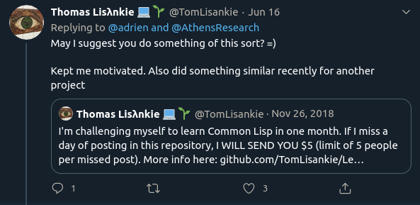

      
    
    
    
    

# Learning Clojure in Public

I am challenging myself to learn Clojure in public. Starting on July 22nd, 2020 and for the next five weeks I will be learning Clojure in public and you can hold me accountable. I am committing the code I am writing to the `./code` folder, and will also write daily posts detailing what I learned and what I did to learn it.

If you would like to read why I am doing this, read the [introduction](posts/2020-06-18.md).

When I announced this on [Twitter](https://twitter.com/adrien/status/1273013237076971528) I got an interesting suggestion:

So here it goes: if I miss a day, you will be able ask me to send you \$5 (Venmo or PayPal preferred). If by the next morning (I often work late) I have not updated this repository with the previous' day's progress you can claim it by reaching out to [me on Twitter](https://twitter.com/adrien). There is a limit of five people per missed post.

| Post | Date            | Topics                                                                                            |
| ---- | --------------- | ------------------------------------------------------------------------------------------------- |
| 0    | June 18th, 2020 | [Why am I doing this, why Clojure, environment setup, and the REPL](posts/2020-06-18.md)          |
| 1    | June 22nd, 2020 | [ClojureFam kickoff and types (Clojure from the Ground Up Chapter 1 & 2)](posts/2020-06-22.md)    |
| 2    | June 23rd, 2020 | [Functions (Clojure from the Ground Up Chapter 3)](posts/2020-06-23.md)                           |
| 3    | June 24th, 2020 | [Manipulating sequences (Clojure from the Ground Up Chapter 4)](posts/2020-06-24.md)              |
| 4    | June 25th, 2020 | [Intro to state and concurrency (Clojure from the Ground Up Chapter 6)](posts/2020-06-25.md)      |
| 5    | June 26th, 2020 | [State and concurrency continued (Clojure from the Ground Up Chapter 6)](posts/2020-06-26.md)     |
| 6    | June 27th, 2020 | [Project setup and exploring data (Clojure from the Ground Up Chapter 7)](posts/2020-06-27.md)    |
| 7    | June 28th, 2020 | [Exploring data and exercises (Clojure from the Ground Up Chapter 7)](posts/2020-06-28.md)        |
| 8    | June 29th, 2020 | [Modeling (Clojure from the Ground Up Chapter 8)](posts/2020-06-29.md)                            |
| 9    | June 30th, 2020 | [Modeling (continued) (Clojure from the Ground Up Chapter 8)](posts/2020-06-30.md)                |
| 10   | July 1st, 2020  | [Debugging Clojure (Clojure from the Ground Up Chapter 10 -- last chapter!)](posts/2020-07-01.md) |
| 11   | July 2nd, 2020  | [Clojure for the Brave and True Chapter 3](posts/2020-07-02.md)                                   |
| 12   | July 3rd, 2020  | [Learn Datalog Today Chapter 0 through 6 and troubleshooting our fist issue](posts/2020-07-03.md) |
