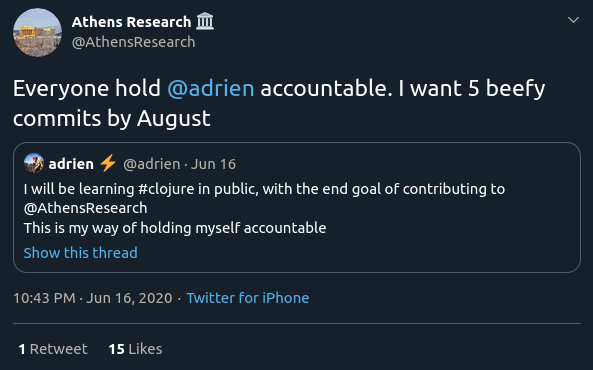

-   # Why Am I Doing This?
    -   Learning is fun, learning in public is harder, so then why am I doing it?
    -   ## 📒 I want to be held accountable
        -   I am doing this for myself (see above, the primary reason is to learn, selfishly) and do not expect any sort of audience. Now if I artificially get an audience by promising easy money, that is a win! If I can't get out of this (not that I will), or if it hurts to skip a day I have a better chance for it to stick.
        -   

        -   Now there's a whole lot of people on Twitter that will hold me accountable!
    -   ## 🤝 I want to meet new people
        -   Since announcing my intention to learn Clojure in public on Twitter, I have already received feedback from strangers, found new (relevant) accounts to follow and been followed by new people.
        -   I am not trying to draw early conclusions, but any interaction around Clojure is already a plus and will probably me more than if I had stayed dark (i.e. learning in my corner).
    -   ## 🦾 I want to create a habit
        -   When I first seriously learned how to write code, I committed to keeping my GitHub streak going. It was after I graduated from bootcamp and I was a TA it was easy to fall off the bandwagon so instead I forced myself to commit something everyday. It didn't matter how small. It went on for a few months until I got a job and I started committing somewhere else.
        -   I hope to recreate this here.
    -   ## ⭕ I want to be corrected
        -   If I don't put anything out there, how will I know when I am wrong? Hopefully I can recreate the feedback loop you can experience in school, but using people of the internet!
    -   ## 👨‍🎤 (if possible) I want to inspire
        -   I was myself inspired by watching others learn in public. If I can convince one person to do it as well (especially if it turns out to be successful) then it's another win.
    -   ## ✍️ I want to get in the habit of writing
        -   I rarely write. And when I do, it's as little as possible. In the description of my pull request I am almost laconic. This is probably an easy way to fight this, not dissimilar to people joining Toastmasters to change their attitude towards public speaking.
-   # Why Clojure?
    -   ## 📖 I want to contribute to open source
        -   Whenever I learned something and it stuck was when I was learning to build something. It has been for myself or someone else. I learned bash scripting when I wanted to automate my media server, I learned JavaScript because I needed to go from websites to applications, etc. I want to contribute to Athens because it's a project I would use so that looks like a good match as well as a learning opportunity.
    -   ## 💻 I've always been interested in Lisps
        -   it started with emacs and I wanted to customize it with emacs-lisp then a curiosity in its own right. I read [Concrete Abstractions – An Introduction to Computer Science Using Scheme](https://gustavus.edu/mcs/max/concrete-abstractions.html) and I've considered tackling Clojure as a lisp that is actually used in production.
    -   ## Other reasons
        -   -   I want to learn something new.
        -   -   I heard it fits very nicely with React, I'm here to see for myself.
        -   -   I am interested in functional programming.
        -   -   And all the other advantages: simplicity, macros, the REPL, ClojureScript
-   # What I Did Today
    -   ## Code editor setup
        -   I already ran the development version of Athens so I do not need to setup the JVM, Clojure or lein. What I need to get ready for though, is writing Clojure and I need to pick a code editor.
        -   At this point I do not know what the ideal setup will be for me so I have setup two different ones and I will later which one is appropriate.
        -   ### Doom Emacs with Cider
            -   Very ironically or not, I stopped using emacs three weeks ago and moved my notes from org-mode to Roam Research. (~~You'll notice that these notes are in org-mode~~ I already gave up, it's much easier to copy paste from Roam to Markdown). So today I fired good old emacs again and set it up for Clojure. Most recently I was a Doom Emacs user, so I promptly uncommented the Clojure line in my init.el and [read the documentation](https://github.com/hlissner/doom-emacs/tree/develop/modules/lang/clojure) I also installed Cider but haven't gotten autocompletion to work just yet.
        -   ### VS Code with Calva
            -   I use VS Code at work, for its effortless integrations with the JavaScript and TypeScript tool chains so I decided to give it a try. The setup was effortless and there was no configuration to get the REPL once I was in Athens repository. However, the extension warns that it conflicts with some vim keybindings in vscodevim and you cannot reset these.
        -   Ultimately what will help me decide is how integrated these two solutions are with other tooling (Does a Prettier solution for Clojure exist out there? That would make my day). It does feel like VS Code is much simpler to setup here, and it's already what I use for JavaScript so I may stick with it.
    -   ## The REPL
        -   Following the on-boarding for [New Clojurians onboarding document](https://www.notion.so/Onboarding-for-New-Clojurians-b34b38f30902448cae68afffa02425c1) I read [this article](https://vvvvalvalval.github.io/posts/what-makes-a-good-repl.html) about the Clojure REPL. In the video, the author uses it to evaluate code that is in his file currently. This is great, it does remove the friction you have when trying something your browser's console: no copy/paste and it's the exact same execution environment. In some ways it reminds me of literate programming as you can execute specific part of the code, in isolation. It's a lot less monolithic than most things I have seen so far. The cURL example from the author particularly resonated with me. Also the fact that the REPL saves your result, so you can work on processing the JSON response of an API over and over again without having to re-fetch it.
        -   ### What are the advantages of the REPL
            -   -   A tight feedback loop
            -   -   Potentially less tests, or better tests especially if you have been writing working code in the REPL, you can reuse it in your tests
        -   I probably won't want this in JavaScript or TypeScript (I doubt that it's that tightly integrated) but I am looking forward working with it in Clojure.
        -   I will most likely go back to this article after I have some Clojure experience under my belt.
