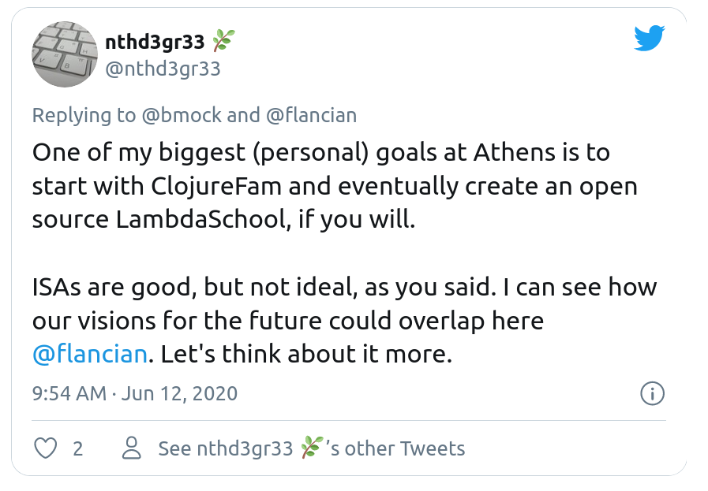

# ClojureFam: how to make it better, and my advice to new learners

## What is ClojureFam

ClojureFam is a learning program for Clojure(script). Learners are put in groups by timezone and start learning in groups. It's great as one's progress pushes the others at the same time. The end goal of ClojureFam is to bring people up to speed with Clojure and the Athens codebase so that they can contribute.

The team behind sees a lot more happening with it. I particularly like the idea of an open-source lambda school.

So over the past 5 weeks, I have gone through the program. On top of it I committed to learning in public, as in post what I have learned or done that day (everyday) in a markdown file and host it in this very repository. Additionally I tweeted a daily (and much shorter) update with a link to the post.

Let's get one thing out of the way before I start commenting on ClojureFam itself, I would absolutely recommend the program to anyone even remotely interested in Clojure or functional programming. It's very rewarding, I loved most of it, and you bond with your cohort quite easily (after all you're in this together).

If a bootcamp prepares you for a job, ClojureFam prepares you for open source contributions. Today it does that for Athens (my team, Team Seneca already has several commits in Athens' codebase), but it can be so much more.

I attended the 6th cohort, which was mentor-less, so my comments are based off of that. I was very hesitant before enrolling because I really wanted a mentor. Besides the idea of building a PKM application the fact that ClojureFam had mentors was really what attracted me to the program. Really the question for me was why would I do ClojureFam over reading a book by myself. I can obviously think of [a few reasons](https://github.com/alaq/learning-clojure-in-public/blob/master/posts/2020-06-18.md) but you need a little something to convince you it is worth the commitment. If you do ClojureFam seriously, it is a time and energy commitment. It's also very rewarding.

## A little disclaimer about my perspective

I am a bootcamp graduate. Before that I was a self taught programmer/learner. Programming has been a hobby of mine for many years. I started with basic in 1999, before I had the Internet. In 2016 I started writing code for my employer, building their internal applications and even started a SaaS company. I felt like I needed a little extra push to turn this into a full time thing, so I enrolled in a bootcamp (Fullstack Academy in New York). This was probably one of my best professional decisions.

### Open source contributions

After bootcamp a lot of my classmates saw that contributing to open source would be a good way to differentiate themselves, so a lot of them ended up contributing to high profile projects such as React or Netlify CMS. I am not sure how many continued beyond their first commit. I can't blame them: landing a commit in React is a thrilling adventure, but it's a lot of work. I felt like I needed something else, maybe a project that I could get to know better. I met Ryan Dahl at BrooklynJS in 2018 and started to contribute to his latest project (PropelML) with his help. I landed a few UI commits and was starting to get a lay of the land. I wanted to regularly contribute small changes and progressively ramp up the size and quality of the contributions. Unfortunately the project was discontinued and Ryan went on to start Deno and I decided to focus on my job and inner source projects instead.

Without further ado, here are a few things I would change in ClojureFam.

## Structure, structure, structure

### Better on-boarding

The repository should become a manual and guide for the learners. It currently feels little bit disjointed.

[Onboarding for New Clojurians](https://www.notion.so/Onboarding-for-New-Clojurians-b34b38f30902448cae68afffa02425c1) should absolutely not live in Notion: it should be in the repository.

Ideally the repository should be the one stop shop for learners. This is coming from my experience in a bootcamp where everything was documented and easily accessible on the in-house platform. If everything is stored in the git repository it becomes something that gets iterated on by learners as people go through the program. The structure should be setup by mentors and contributors initially, but the details can

The curriculum should be stricter, since most people will know very little. The default should be to choose for them.

### The curriculum should be adjusted so the progression makes sense.

Starting with Clojure from the Ground Up and then redoing most of it in Clojure for the Brave and True made complete sense to me. The former was the introduction and the latter let me go more in depth and solidified my knowledge.

There are still some chapters that are not essential and can be skipped at the beginning. Concurrency should be kept, macros should go. The last few chapters of Brave Clojure could also wait until after ClojureFam.

For instance, one of the first tasks in the curriculum issue, along with setting up your editor, is to review the entire Athens codebase. I'm very glad I put this off for a couple of weeks because if you don't know [[re-frame]] you're going to be lost and it's going to be a waste of your time.

Similarly there should be a point in time when the learner can start tackling Athens' issues, and curriculum says so obviously. It seems that the learner would need at least to know about atoms to understand re-frame. And some knowledge of re-frame and datascript (and maybe some Datalog, depending on the issue) is probably needed. I see the curriculum as a tree, and different milestones unlock separate branches for the learner.

### The curriculum should leave less decision to the learner

This is a logical extension of the learning tracks. It should be uniformized across learners. Ideally learners of a cohort should be learning the same thing at the same time, doing the same 4clojure problems (even together, ideally!). If someone is doing something different, it should be because they are already intermediate level and will be able to help the learners with less experience anyway.

## Better tracking

The current tracking board in the ClojureFam repository is nice, but I am not sure everyone is actually updating their issues (unless they dropped out?) or that anyone is actually checking out other learners' issues. Honestly I had no idea if anyone was doing the program at the same time as us. The only hints have been the occasional PRs from people I knew were learners. I feel like learners would benefit greatly from seeing other learrners' progress, it would create some sort of emulation. I suggested we post updates on our issues, but even I did it only once, whereas I was able to post updates every day on twitter (maybe that was the issue). ~~There could also be a Discord channel for learners to share their daily/weekly updates.~~ It has just been [created](https://discord.com/channels/708122962422792194/738157252938170429).

## Gamification

Taking the idea of tracking a step further would be to gamify the learning process. We sort of have this with the progress bar on the Github but the concept could be taken further. There may even be an open source solution out there that does this.

I can see a gamified curriculum where when you learn about atoms in Clojure from the ground up you unlock the front end track with the basics of clojurescript, reagent and re-frame.

## Foster community

Tracking, gamifying the system and overall being aware of what others are doing are definitely a way to foster the community.

There are other things that can be done to foster the community around Athens:

office hours could be super useful, especially for mentor-less cohorts. Learners could still rely on a more experienced developers to bounce of ideas, silly questions etc. Maybe current mentors can help in an ad-hoc fashion. It would be much less time consuming and probably more efficient overall.

The point I am making with better tracking will also help community

Ideally people would also make better use of the #learning channel, which would create connections between current and past learners

Learners should be encouraged to ask questions on pull requests (that could be almost a mandatory step). They will learn, but also start meeting contributors.

## Other suggestions

As Athens matures it will need developer documentation (for instance, how does Athens store data, how are keybindings handled) and it could be written by learners and reviewed by contributors.

There is also room for articles about the Clojure, and the codebase. For instance there is a need (when the codebase will be mature enough) for an article about the architecture of Athens. Think folder structure, glossary (what is datascript, posh, etc. how do they fit in together)

Encourage learners to find out about re-frame earlier and only after that look into the Athens codebase. It’s pointless if you don’t know about the 6 dominoes.

If the program was a little longer there would be room for a side project. Mani and I did it, and it helped us greatly in our understanding of re-frame. It's one thing to read a tutorial and write the same exact code at the same time, it's another to attempt to do it in a quasi real life situation. A good inspiration for little side projects to tackle would be [50-projects-for-react-and-the-static-web](https://github.com/colbyfayock/50-projects-for-react-and-the-static-web) by Colby Fayock. I built a [decide wheel](https://wheeldecide.com/wheels/chance-fortune/yes-or-no-decision-maker/) [clone](https://github.com/alaq/hail-the-wheel).

## Contributing to Athens

Let me start with saying that it's probably one of the best organized projects I have tried to contribute to. You can see that it's designed to let the core team have a birds eye view of what is in flight, future features, bug fixes while still making it understandable for newcomers. That being said, a few things may be doable to make it easier for newbies.

The issues could be easier to find. Currently there are some issues, there are some bullet points in the same issues, there are some cards in the projects.

Editor setup has been a mess for me. I started with VS Code with Calva but the vim keybinding don't work too well there (no support in the REPL for instance), then moved to Doom Emacs with CIDER. In neither of these editor did I manage to make the REPL work with the currently edited file (unless I was using `use`). Now I am seriously considering trying out Cursive with the IdeaVim plugin. I'm not trying to blame anyone for my own shortcomings: the information is out there and ir's not Athens specific but I just wish the Clojure onboarding was a tiny bit better. By comparison, TypeScript on VS Code is amazing, everything works out of the box.

## My advice for the next cohorts of learners

### Learn in public

I decided to write an article a day about what I learned. Obviously it was more useful to me than to anyone else. It helped me reflect on and solidify my knowledge. I did engage with a few people, which was nice but most of all it is probably what kept me going the most. I HAD to post that update, and if I didn't have anything to write about, I wouldn't have been able to.

### Do it everyday

Even if you don't have time that day, find the time. Even 30 minutes, which I am sure you can find, is enough. It really helps to push the ball a little bit further everyday, it's constant progress and will prevent you from falling off the bandwagon. If you have evening plans, wake up a little early. If you can't do that take a break during lunch. Or go to bed late. I've done a combination of all of it. It's not easy but it's only 35 days, you can do it.

### Power through the 35 days, you'll thank me

Do it, do 35 days, don't slack and I promise you will reach a minimum level where you'll be able to be productive enough so that it will be self sustainable. Hopefully by then you're contributing to the Athens codebase, and building your own little projects. Starting a new language is easy, especially if you know others, then it's getting really familiar with the libraries and the codebase that can be a little daunting. That's when you need to keep at it without break.

## Parting words

I absolutely recommend ClojureFam in its current form to anyone who is every remotely interested in Lisps and/or functional programming. It's a brand new world if you're coming from more object oriented languages.

The goal for me now is to turn my learning in public experience into a building in public one. I really believe in the Athens project and would love to get to a Clojure level that would let me make substantial contributions.

In true 20/80 fashion I will leave you with a few easily doable action points:

-   [ ] Improve landing page - it should answer questions as to how to get started (part of it is making the chosen curriculum more obvious, and stricter). In that landing page there should be a "Getting Started" section. We see these questions pop up at every start of every new cohort.
-   [ ] Remove some unnecessary chapters from the curriculum, they can always be tackled after ClojureFam
-   [ ] Turn the current curriculum into a tree shaped one
-   [ ] Move onboarding for new clojurians to the clojurefam repository
-   [ ] create a learn-in-public channel on Discord
